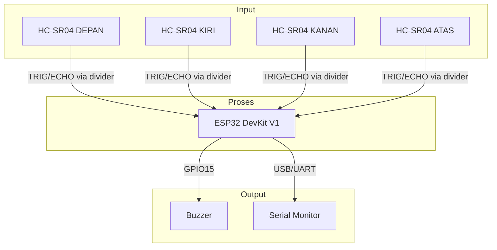
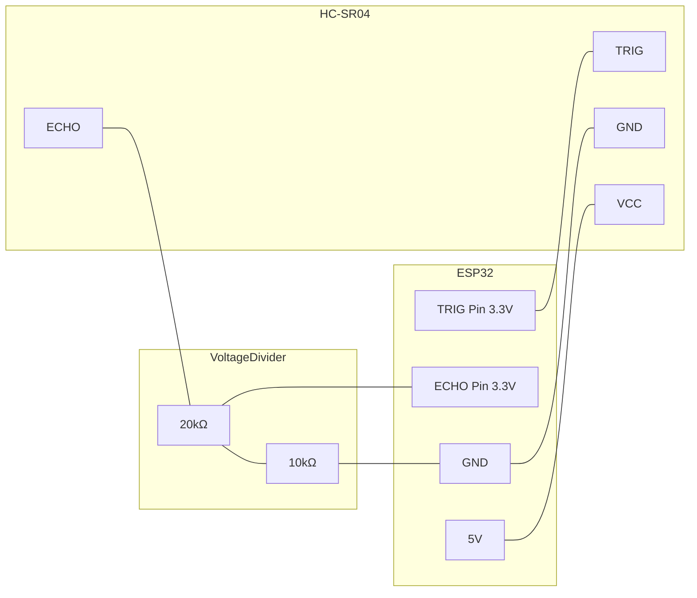
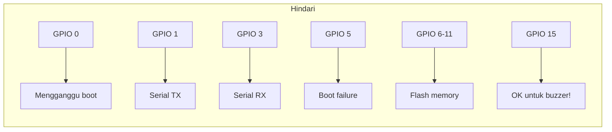
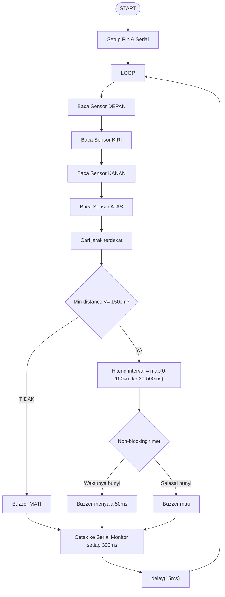
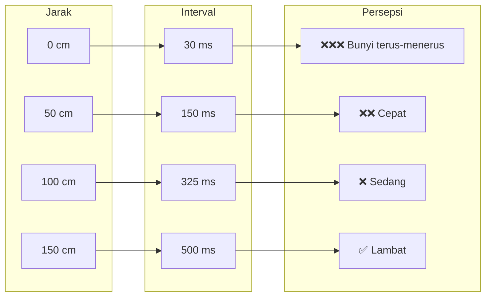
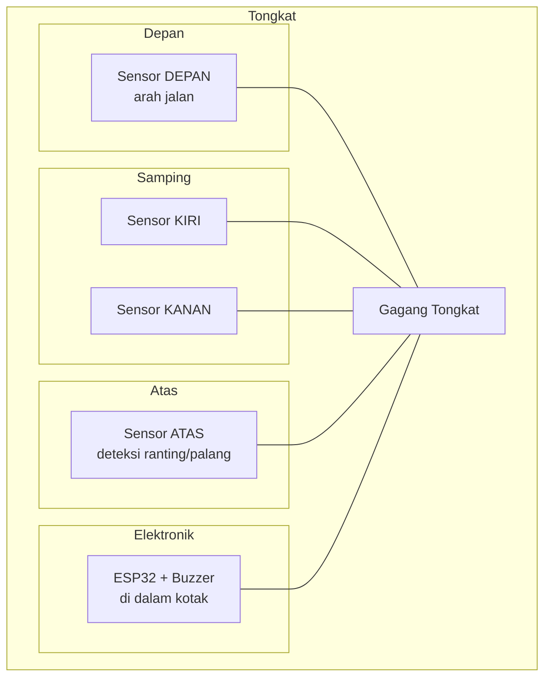
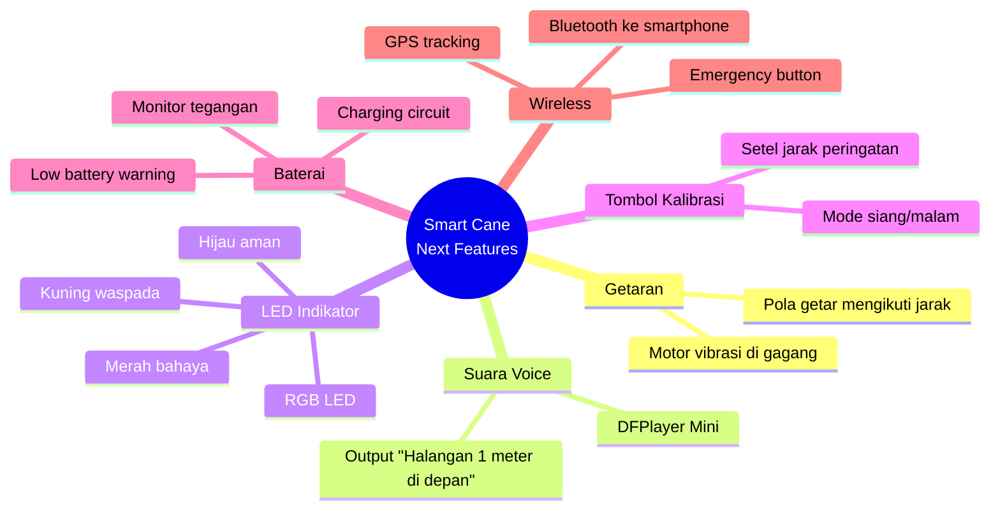

# 🦯 Smart Cane for Visually Impaired People

> Tongkat pintar berbasis ESP32 dengan 4 sensor ultrasonik dan buzzer untuk membantu mobilitas penyandang tuna netra.


---

## 📋 Daftar Isi

- [Tentang Proyek](#-tentang-proyek)
- [Fitur Utama](#-fitur-utama)
- [Komponen Hardware](#-komponen-hardware)
- [Wiring Diagram](#-wiring-diagram)
- [Pin Configuration](#-pin-configuration)
- [Flowchart Sistem](#-flowchart-sistem)
- [Instalasi & Setup](#-instalasi--setup)
- [Cara Penggunaan](#-cara-penggunaan)
- [Output Serial Monitor](#-output-serial-monitor)
- [Pengembangan Lebih Lanjut](#-pengembangan-lebih-lanjut)
- [Troubleshooting](#-troubleshooting)
- [Lisensi](#-lisensi)

---

## 🎯 Tentang Proyek

**Smart Cane** adalah alat bantu mobilitas bagi penyandang tuna netra yang menggunakan 4 sensor ultrasonik untuk mendeteksi halangan di **depan, kiri, kanan, dan atas**. Sistem ini memberikan umpan balik berupa bunyi buzzer yang semakin cepat ketika halangan semakin dekat, mirip dengan sensor parkir mobil.

### 🧠 Bagaimana Cara Kerjanya?
Halangan terdeteksi → Baca jarak 4 sensor → Cari jarak terdekat →
→ Hitung interval bunyi → Buzzer berbunyi sesuai interval
→ Semakin dekat → Interval semakin pendek → Bunyi semakin cepat

---

## ✨ Fitur Utama

| Fitur | Deskripsi |
|-------|------------|
| 🔍 **4 Arah Deteksi** | Depan, Kiri, Kanan, dan Atas (palang rendah/ranting) |
| 🔊 **Buzzer Progresif** | Interval bunyi menyesuaikan jarak (30-500ms) |
| ⚡ **Non-blocking** | Menggunakan `millis()` → tidak mengganggu pembacaan sensor |
| 📊 **Debugging Real-time** | Serial Monitor menampilkan jarak semua sensor + arah terdekat |
| 🔧 **Pin Aman ESP32** | Menggunakan GPIO yang tidak mengganggu proses boot |
| 🧩 **Modular Code** | Struktur array sensor memudahkan penambahan/penyesuaian |

---

## 🧱 Komponen Hardware

| Komponen | Jumlah | Spesifikasi |
|----------|--------|--------------|
| ESP32 DevKit V1 | 1 | Mikrokontroler utama |
| HC-SR04 | 4 | Sensor ultrasonik (2cm - 400cm) |
| Buzzer | 1 | Aktif (5V) atau Pasif (PWM) |
| Resistor 20kΩ | 4 | Pembagi tegangan (seri) |
| Resistor 10kΩ | 4 | Pembagi tegangan (pull-down) |
| Breadboard | 1 | Untuk prototyping |
| Kabel Jumper | Secukupnya | Male-to-female / male-to-male |
| Catu Daya | 1 | 5V / 2A (misal power bank) |

### ⚠️ Catatan Penting
> **Semua pin ECHO dari HC-SR04 (output 5V) WAJIB melalui pembagi tegangan (20kΩ seri + 10kΩ pull-down ke GND)** sebelum masuk ke ESP32 (3.3V). Jika tidak, pin ESP32 bisa rusak secara permanen.

---

## 🔌 Wiring Diagram

Berikut adalah diagram koneksi lengkap menggunakan **Mermaid**:

### Diagram Blok Sistem



Skema Koneksi Per Sensor

Tabel Koneksi Lengkap

```mermaid
flowchart TD
    subgraph Power
        P5V[ESP32 5V] --- VCC1[VCC Sensor1]
        P5V --- VCC2[VCC Sensor2]
        P5V --- VCC3[VCC Sensor3]
        P5V --- VCC4[VCC Sensor4]
        
        PGND[ESP32 GND] --- GND1[GND Sensor1]
        PGND --- GND2[GND Sensor2]
        PGND --- GND3[GND Sensor3]
        PGND --- GND4[GND Sensor4]
        PGND --- BZGND[Buzzer GND]
    end
    
    subgraph GPIO
        G13[GPIO13] --- T1[TRIG Sensor1]
        G12[GPIO12] --- VD1[Voltage Divider] --- E1[ECHO Sensor1]
        
        G16[GPIO16] --- T2[TRIG Sensor2]
        G27[GPIO27] --- VD2[Voltage Divider] --- E2[ECHO Sensor2]
        
        G26[GPIO26] --- T3[TRIG Sensor3]
        G25[GPIO25] --- VD3[Voltage Divider] --- E3[ECHO Sensor3]
        
        G21[GPIO21] --- T4[TRIG Sensor4]
        G32[GPIO32] --- VD4[Voltage Divider] --- E4[ECHO Sensor4]
        
        G15[GPIO15] --- BZP[Buzzer Positive]
    end
```


## 📊 Pin Configuration

### ESP32 DevKit V1 - Pin Assignment
| Sensor | Posisi | Trigger (GPIO) | Echo (GPIO) | Keterangan |
|--------|--------|---|---|---|
| Sensor 1 | DEPAN | 13 | 12 | Pin aman untuk boot |
| Sensor 2 | KIRI | 16 | 27 | GPIO16 aman, GPIO27 aman |
| Sensor 3 | KANAN | 26 | 25 | Kedua pin aman |
| Sensor 4 | ATAS | 21 | 32 | GPIO21 aman, GPIO32 aman (PWM saat boot, masih OK) |
| Buzzer | - | 15 | - | Internal pull-down, aman untuk boot |

🚫 Pin yang HARUS DIHINDARI pada ESP32


🔄 Flowchart Sistem


Logika Interval Buzzer


💻 Instalasi & Setup
1. Clone Repository
bash
git clone https://github.com/username/smart-cane-esp32.git
cd smart-cane-esp32
2. Install PlatformIO (VS Code Extension)
Buka VS Code

Install extension PlatformIO IDE

Restart VS Code

3. Buka Project
bash
File → Open Folder → Pilih folder project
4. Konfigurasi platformio.ini
File ini sudah disediakan, isinya:

```ini
[env:esp32dev]
platform = espressif32
board = esp32dev
framework = arduino
monitor_speed = 115200
```
5. Upload ke ESP32
bash
# Klik tombol → (Panah kanan) di bagian bawah VS Code
# Atau gunakan terminal:
pio run --target upload
6. Buka Serial Monitor
bash
# Klik tombol 🔌 (Plug) di bagian bawah VS Code
# Atau:
pio device monitor
🎮 Cara Penggunaan
Pemasangan Sensor pada Tongkat


Pola Respons Buzzer
Jarak Halangan	Interval Bunyi	Persepsi
> 150 cm	Tidak berbunyi	Aman ✅
100 - 150 cm	300 - 500 ms	Waspada, bunyi lambat
50 - 100 cm	100 - 300 ms	Perhatian, bunyi sedang
20 - 50 cm	50 - 100 ms	Bahaya, bunyi cepat
0 - 20 cm	30 - 50 ms	KRITIS! bunyi nyaris terus
📟 Output Serial Monitor
Setelah program berjalan, buka Serial Monitor (115200 baud). Contoh output:

```text
========================================
TONGKAT TUNA NETRA v1.0
4 Sensor Ultrasonik + Buzzer
========================================

✓ Sensor DEPAN siap
✓ Sensor KIRI siap
✓ Sensor KANAN siap
✓ Sensor ATAS siap
✓ Buzzer siap

SISTEM SIAP! Dekatkan halangan ke sensor...
========================================

[INFO] DEPAN: 125cm  KIRI: 180cm  KANAN: 200cm  ATAS: 90cm  | MIN: 90cm (ATAS)
      Buzzer interval: 310ms (semakin kecil = semakin dekat)

[INFO] DEPAN: 45cm  KIRI: 178cm  KANAN: 200cm  ATAS: 88cm  | MIN: 45cm (DEPAN)
      Buzzer interval: 110ms (semakin kecil = semakin dekat)

[INFO] DEPAN: 15cm  KIRI: 175cm  KANAN: 200cm  ATAS: 85cm  | MIN: 15cm (DEPAN)
      Buzzer interval: 45ms (semakin kecil = semakin dekat)
```

🚀 Pengembangan Lebih Lanjut

### Fitur yang Dapat Ditambahkan


### Contoh Kode Tambahan (Mode Getaran)

```cpp
// Tambahkan pin motor vibrasi
#define VIBRATION_MOTOR 4

// Di loop(), setelah handleBuzzer()
if (minDistance < WARNING_DISTANCE_CM) {
  int vibrationIntensity = map(minDistance, 0, WARNING_DISTANCE_CM, 255, 50);
  analogWrite(VIBRATION_MOTOR, vibrationIntensity);
} else {
  analogWrite(VIBRATION_MOTOR, 0);
}
```

🛠 Troubleshooting

### Masalah Umum & Solusi

| Masalah | Kemungkinan Penyebab | Solusi |
|--------|--|--|
| ESP32 tidak booting | Pin 0,2,5,15 terhubung HIGH | Lepaskan kabel dari pin tersebut saat boot |
| Sensor membaca 0cm terus | Echo tidak terbaca atau pin salah | Periksa wiring & voltage divider |
| Sensor membaca nilai tidak stabil | Interferensi antar sensor | Tambahkan delay kecil antar pembacaan |
| Buzzer tidak berbunyi | Pin salah atau buzzer aktif vs pasif | Coba balik polaritas, ganti ke GPIO lain |
| Jarak tidak akurat | Suhu ruangan | Sesuaikan SOUND_SPEED_CM_US (0.0343 = 20°C) |
| Serial Monitor tidak muncul | Baud rate salah | Set ke 115200 baud |
### Cepat Tes Sensor
Upload kode berikut untuk tes satu sensor:

```cpp
#define TRIG 13
#define ECHO 12

void setup() {
  Serial.begin(115200);
  pinMode(TRIG, OUTPUT);
  pinMode(ECHO, INPUT);
}

void loop() {
  digitalWrite(TRIG, LOW);
  delayMicroseconds(2);
  digitalWrite(TRIG, HIGH);
  delayMicroseconds(10);
  digitalWrite(TRIG, LOW);
  
  long duration = pulseIn(ECHO, HIGH);
  float distance = duration * 0.0343 / 2;
  
  Serial.print("Jarak: ");
  Serial.print(distance);
  Serial.println(" cm");
  delay(500);
}
```
## 📄 Lisensi

Proyek ini dilisensikan di bawah **MIT License**. Lihat file `LICENSE` untuk detail lengkap.

```text
MIT License

Copyright (c) 2026 [Nama Anda]

Permission is hereby granted, free of charge, to any person obtaining
a copy of this software and associated documentation files (the "Software"),
to deal in the Software without restriction, including without limitation
the rights to use, copy, modify, merge, publish, distribute, sublicense,
and/or sell copies of the Software, and to permit persons to whom the
Software is furnished to do so, subject to the following conditions:

The above copyright notice and this permission notice shall be included in
all copies or substantial portions of the Software.
```

---

## 🙏 Kontribusi

Kontribusi selalu disambut baik! Silakan:

1. Fork repository
2. Buat branch fitur (`git checkout -b fitur-baru`)
3. Commit perubahan (`git commit -m 'Menambah fitur X'`)
4. Push ke branch (`git push origin fitur-baru`)
5. Buat Pull Request

---

## 📞 Kontak

- **Author**: [Nama Anda]
- **Email**: email@example.com
- **Project Link**: https://github.com/username/smart-cane-esp32

---

## 🌟 Dukungan

Jika proyek ini bermanfaat, beri ⭐ di GitHub! Dengan dukungan Anda, proyek ini dapat terus dikembangkan untuk membantu lebih banyak penyandang tuna netra.

**Made with ❤️ for better mobility**